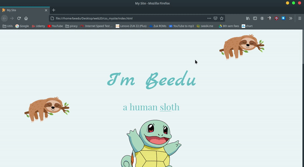

# Web Development 
After months of procrastination during the pandemic, I decided to give this a go. In this repository I will be logging my progress of a Web Development course provided by [Udemy](https://www.udemy.com/ "Udemy Homepage").

#### Course: [The Complete 2020 Web Development Bootcamp](https://www.udemy.com/course/the-complete-web-development-bootcamp/ )
#### Instructor: [Dr. Angela Yu](https://www.udemy.com/user/4b4368a3-b5c8-4529-aa65-2056ec31f37e/)

#### The following websites were heavily used during the course 
- [MDN Docs](https://developer.mozilla.org/en-US/)
- [Codeply](https://www.codeply.com/p)
- [Bootstrap documentation](https://getbootstrap.com/docs/4.5/getting-started/introduction/)

### Course Contents

1. HTML	
	- Structuring text
	-  Lists
	-  Image Elements
	-  Links and Anchor tags
	-  Tables
	-  Forms

2. CSS
	- Inline vs Internal vs External CSS
	-  Debugging CSS code
	-  Selectors
	-  Classes vs IDs
	-  Favicons*
	-  HTML divs
	-  Box Model
	-  Positioning
	
	After completing this module I ended up styling a profile page
	#### CSS Result
	

3. Bootstrap (and some more CSS concepts)
	-  Navbar
	-  Grid Layout
	-  Containers
	-  Buttons
	-  Font Awesome*
	-  Carousel
	-  Cards
	-  Stacking order and z-index
	-  Media Query Breakpoints
	-  Refactoring (don't be a lazy and just do it!)
	
	I made a responsive landing page for an app after completing the Bootstrap module
	#### Web Version
	
	 
	#### Mobile Version	
	

4. JavaScript ES6
	- Programming Paradigms (Conditionals, Loops etc)
	- DOM Manipulation
	- JavaScript Objects
	- Events and EventListeners
	- Higher Order Functions
	- Callbacks
	- jQuery

	Final Results after module completion

	#### Dice Game
	
	 

	#### Drum Kit
	<video width="400" controls>
  		<source src="./results/drumkit.mp4" type="video/mp4">
	</video>
	 
	
	#### Simon Game
	The Game Generates a colour sequence which the user has to remember and press the appropriate buttons.
	On succesfully completing the pattern, the level is upgraded and failure to do so, resets the game.
	 
	<video width="400" controls>
  		<source src="./results/simon.mp4" type="video/mp4">
	</video>

5. The Backend
	- [Node.js](https://nodejs.org/en/ "NodeJS")
	- Node REPL
	- [Native Node Modules](https://nodejs.org/api/modules.html "Modules")
	- [Node Package Manager](https://www.npmjs.com/ "NPM")
	- Packages Explored
		- [Express](https://www.npmjs.com/package/express "express")
		- [Body Parser](https://www.npmjs.com/package/body-parser "body-parser")
		- [Nodemon](https://www.npmjs.com/package/nodemon "nodemon")
	- Application Routes
	- Handling Requests and Responses
