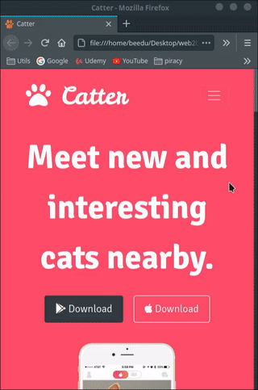
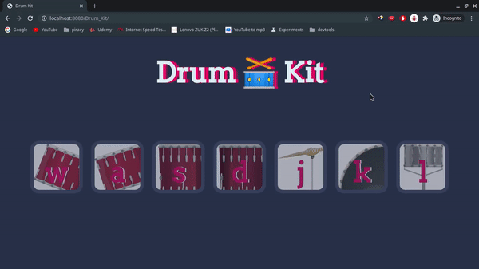
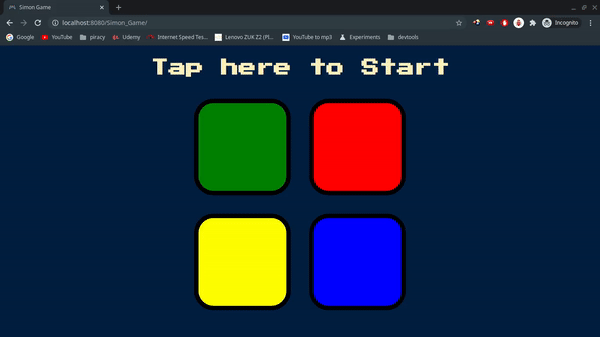
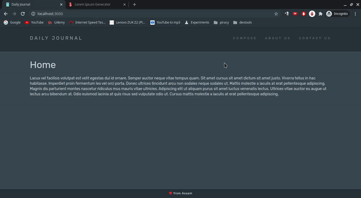
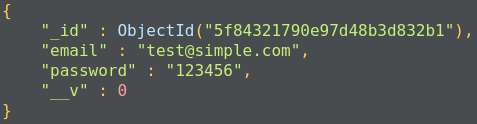
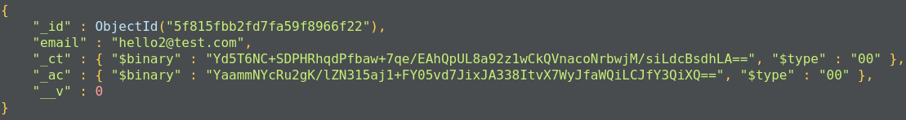
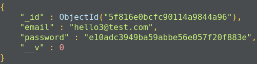
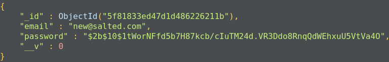
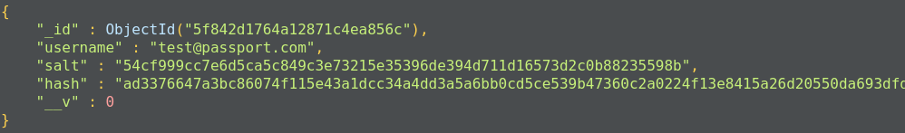
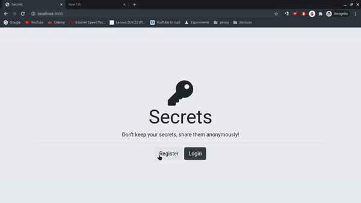

# Web Development 
After months of procrastination during the pandemic, I decided to give this a go. In this repository I will be logging my progress of a Web Development course provided by [Udemy](https://www.udemy.com/ "Udemy Homepage").

#### Course: [The Complete 2020 Web Development Bootcamp](https://www.udemy.com/course/the-complete-web-development-bootcamp/ )
#### Instructor: [Dr. Angela Yu](https://www.udemy.com/user/4b4368a3-b5c8-4529-aa65-2056ec31f37e/)

Some of the stuff I worked on should be accessible [here](https://beedu18.github.io/webdev/ "github pages")

Till Directory #6 everything works on the client side.
Proceeding onwards, you'll need `npm` to install the dependencies and can run the server with `node`.

In the respective directory run the command  `npm install` or `npm i` to install the dependencies. And then you can start the server with `node app.js` 

Most should be accessible with `http://localhost:3000/`, but do take a look at the server file to verify the port number (it should also be logged in the prompt, but I might've gotten lazy while writing some files)

And for the demos that need a database, you should have `mongod` running on the default port

`mongodb://localhost:27017/`

### Course Contents

1. HTML	
	- Structuring text
	-  Lists
	-  Image Elements
	-  Links and Anchor tags
	-  Tables
	-  Forms

2. CSS
	- Inline vs Internal vs External CSS
	-  Debugging CSS code
	-  Selectors
	-  Classes vs IDs
	-  Favicons*
	-  HTML divs
	-  Box Model
	-  Positioning
	
	Ended up styling a profile page after module completion
	#### CSS Result
	

3. Bootstrap (and some more CSS concepts)
	-  Navbar
	-  Grid Layout
	-  Containers
	-  Buttons
	-  Font Awesome*
	-  Carousel
	-  Cards
	-  Stacking order and z-index
	-  Media Queries
	-  Refactoring (don't be a lazy and just do it!)
	
	Made a responsive landing page for an app after completing the Bootstrap module
	#### Web Version
	
	 
	#### Mobile Version	
	

4. JavaScript ES6
	- Programming Paradigms (Conditionals, Loops etc)
	- DOM Manipulation
	- JavaScript Objects
	- Events and EventListeners
	- Higher Order Functions
	- Callbacks
	- jQuery

	Final Results after module completion

	#### Dice Game
	
	 

	#### Drum Kit
	
	
	#### Simon Game
	The Game Generates a colour sequence which the user has to remember and press the appropriate buttons.
	On succesfully completing the pattern, the level is upgraded and failure to do so, resets the game.
	 
	

5. The Backend
	- [Node.js](https://nodejs.org/en/ "NodeJS")
	- Node REPL
	- [Native Node Modules](https://nodejs.org/api/modules.html "Modules")
	- [Node Package Manager](https://www.npmjs.com/ "NPM")
	- Packages Explored
		- [Express](https://www.npmjs.com/package/express "express")
		- [Body Parser](https://www.npmjs.com/package/body-parser "body-parser")
		- [Nodemon](https://www.npmjs.com/package/nodemon "nodemon")
	- Application Routes
	- Route Parameters
	- Handling Requests and Responses

6. APIs
	- Endpoints
	- Authentication
	- Parameters
	- Calls Using
		- Https Node Module
		- Fetch API
	
	Results

	#### Giphy API for Sticker Search
	

7. Templating
	- Why Templating?
	- [Embedded JavaScript (EJS)](https://ejs.co/ "EJS") templates
	- Types of EJS tags
	- Layouts
	- EJS Partials
	- Add custom modules to project*

	Results

	#### Todo List v1
	
	
	#### Blog Website v1
	

8. Databases
	- SQL and NoSQL Databases
	- Exploring [MongoDB](https://docs.mongodb.com/ "mongodb")
		- Collections
		- Documents
	- Native Driver vs [Mongoose](https://mongoosejs.com/docs/guide.html "mongoose")
	- [CRUD](https://mongoosejs.com/docs/api.html "mongoose crud") operations using Mongoose
		- Document.prototype.save(), Model.insertMany()
		- Model.find()
		- Model.updateOne(), Model.updateMany() 
		- Model.deleteOne(), Model.deleteMany()
		- $push and $pull using Model.findOneAndUpdate()
	- Document Validation in Mongoose

	Results

	#### Todo List Made persistent using database
	
	
	#### CRUD operation support added to blog site
	

9. REpresentational State Transfer
	- HTTP Requests
		- GET
		- POST
		- PUT
		- PATCH
		- DELETE
	- Built a simple RESTful API from scratch
	- Tools used while testing
		- [Robo3T](https://robomongo.org/download "Robo3T") (GUI application for visualizing Mongo Databases)
		- [Postman](https://www.postman.com/ "Postman") (API development platform)

10. Authentication and Security
	- Level 1 Authentication - Email and Password
		- Using Simple Database Schema
		- 
	
	- Level 2 Authentication - Database Encryption
		- Using mongoose-encrypt
		- 
	
	- Level 3 Authentication - Password Hashing
		- Using md5
		- 

	- Level 4 Authentication - Salting and Password Hashing
		- Using bcrypt
		- 

	- Level 5 Authentication - Sessions and Cookies
		- Using PassportJS (local)
		- 
		
	Results

	#### Post Secrets 
	Simple page where users can register or login and can view or add new secrets

	